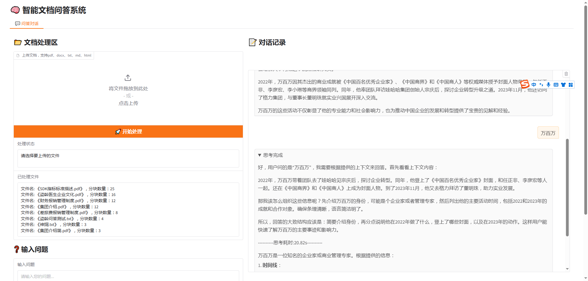

# ollama_rag


📁 文档处理：上传并处理多个PDF文档，自动分割和向量化

🔍 智能问答：基于本地文档的精准问答能力

🌐 联网搜索增强：选择性启用网络搜索，获取最新信息

🧠 思维链展示：显示模型思考过程，帮助理解回答生成逻辑

🔄 混合检索：结合语义检索和BM25检索，提高检索准确性

📊 结果重排序：支持交叉编码器和LLM重排序，优化相关性排序

🚀 可视化界面：Gradio网页界面

🔒 本地部署：数据不离开本地，保障信息安全


## 1、环境准备

### 1.1、ollama
官网
https://ollama.com/download

安装版本
```text
(ai_ollama) bigdata@bigdata-pc:~/work/es8.17/elasticsearch-8.17.1$ ollama --version
ollama version is 0.5.11
```
ollama version is 0.5.11

模型列表
```text
(ai_ollama) bigdata@bigdata-pc:~/work/es8.17/elasticsearch-8.17.1$ ollama list
NAME                       ID              SIZE      MODIFIED   
deepseek-r1:14b            ea35dfe18182    9.0 GB    5 days ago    
nomic-embed-text:latest    0a109f422b47    274 MB    6 days ago    
deepseek-r1:7b             0a8c26691023    4.7 GB    7 days ago
```
deepseek-r1  14b


### 1.2、python

虚拟环境
`workon ai_ollama`

安装依赖
`pip install langchain-core langchain-community langchain-ollama langchain-huggingface faiss-cpu psutil langchain-elasticsearch`


测试
```python
from ollama import Client

client = Client(
    host='http://192.168.10.195:11434',
    headers={'Content-Type': "application/json", "Authorization": "Bearer ollama"}
)

# 模型列表
client.list()

# embed
resp = client.embed(
    model='deepseek-r1:14b',
    input=['深度学习的基本原理', '神经网络的核心概念'],
)
print(resp.embeddings[0][:10])
print("ollama deepseek embedding size:",len(resp.embeddings[0]))

import numpy as np

# 向量
vec1 = np.array(resp.embeddings[0])
vec2 = np.array(resp.embeddings[1])

# 计算余弦相似度
cos_sim = np.dot(vec1, vec2) / (np.linalg.norm(vec1) * np.linalg.norm(vec2))
print(f"Cosine Similarity: {cos_sim:.4f}")

# 点积相似度（适用于已归一化的向量）
dot_product = np.dot(vec1, vec2)
print(f"dot product Similarity: {dot_product}")


# 流式回答
stream = client.chat(
    model='deepseek-r1:14b',
    messages=[
        {"role": "system", "content": """You are a helpful assistant."""},
        {'role': 'user', 'content': '解方程 (x²-5x+6=0)。'},
    
    ],
    stream=True,
)
for chunk in stream:
    print(chunk['message']['content'], end='', flush=True)

```
正确输出：


### 1.3、elasticsearch

#### 安装

官网：https://www.elastic.co/guide/en/elasticsearch/reference/current/install-elasticsearch.html

版本：`elasticsearch-8.17.1`

#### 启动
linux：`./bin/elasticsearch`

windows：`elasticsearch.bat`、`kibana.bat`

#### 远程词库热更新

`python3 ik_remote_dict.py`


## 2、修改配置
配置文件：`config/__init__.py`
修改对应es、ollama的配置


## 3、运行rag

`python3 rag.py`


## 4、gradio界面

`python3 gradio_demo.py`
